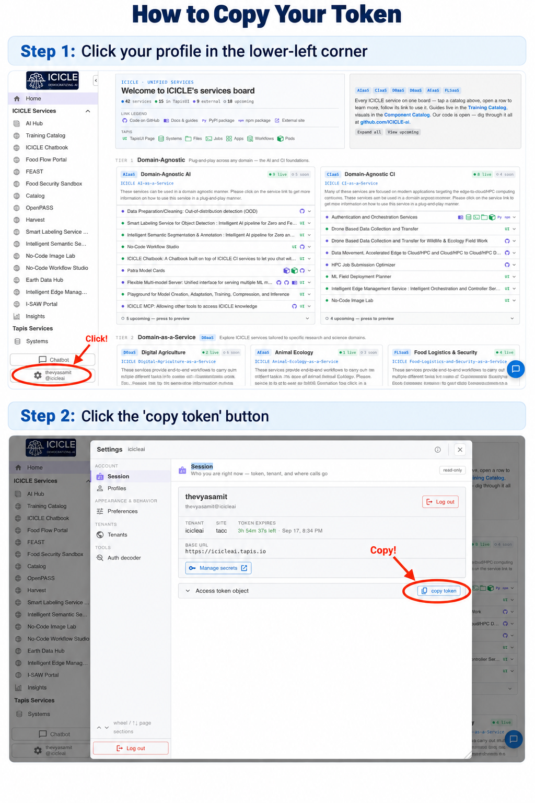

# ICICLE AI Chatbook

An interactive [marimo](https://marimo.io/) notebook that turns the ICICLE AI Tapis services into a hands-on RAG (retrieval-augmented generation) playground. Paste text or upload a document (**PDF**, **DOCX**, **TXT**, or **MD**, up to 2 MB), ingest it into the vector store, and chat against it — the notebook chains the embed, vector, and chat services behind a single Tapis access token. Two ways to ask, into one conversation: send a question straight away, or jot questions into a notes pad as you read and send them as a batch.

**Tags:** AI4CI, Software

For guidance on what to include in Tutorials, How-To Guides, Explanation, and Reference, see [Diátaxis](https://diataxis.fr/).

### License

[](https://www.gnu.org/licenses/gpl-3.0)

## References

- [ICICLE AI Tapis portal](https://icicleai.tapis.io) — where you log in and grab an access token.
- [Embedding service (`icicleaiembedserver`)](https://github.com/ICICLE-ai/icicle-ai-embed-service) — Qwen3-Embedding behind a JWT-gated FastAPI.
- [Vector service (`icicleaivecserver`) API docs](https://github.com/ICICLE-ai/icicle-ai-vector-service) — Qdrant-backed store with cosine + MMR retrieval.
- [marimo documentation](https://docs.marimo.io/) — the reactive Python notebook used to host this playground.
- [uv documentation](https://docs.astral.sh/uv/) — the package/env manager used to bootstrap the project.

## Acknowledgements

<!-- Please include other funding sources above this line. -->

*National Science Foundation (NSF) funded AI institute for Intelligent Cyberinfrastructure with Computational Learning in the Environment (ICICLE) (OAC 2112606)*

## Issue reporting

File bugs, ideas, or questions on the [GitHub issues page](https://github.com/thevyasamit/icicle-chatbook/issues).

---

# Tutorials

## Run the RAG playground end-to-end

This tutorial walks a first-time user from a clean checkout to chatting with their own document.

### Prerequisites

- macOS or Linux shell (the commands below are zsh/bash).
- [`uv`](https://docs.astral.sh/uv/) installed (`brew install uv` on macOS).
- A free account on the [ICICLE AI Tapis portal](https://icicleai.tapis.io) — TACC login, CILogon (university SSO), or self-signup all work.

### Steps

1. **Clone and enter the repo.**
   ```bash
   git clone https://github.com/thevyasamit/icicle-chatbook.git
   cd icicle-chatbook
   ```
2. **Sync the environment.** `uv` reads `pyproject.toml` + `uv.lock` and creates `.venv/` with `marimo` and `requests` pinned.
   ```bash
   uv sync
   ```
3. **Launch the notebook in app mode** (code hidden, chat-style UI):
   ```bash
   uv run marimo run notebooks/rag_chat_marimo.py
   ```
   Or in editor mode (code visible, hot-reload) while developing:
   ```bash
   uv run marimo edit notebooks/rag_chat_marimo.py
   ```
4. **Grab a Tapis access token** from [icicleai.tapis.io](https://icicleai.tapis.io) (click your username in the bottom-left → *Copy Access Token*), paste it into the token box, and click **🔐 Validate token**. Deployed as a Tapis pod, this step disappears — see [Sign-in: pasted token or Tapis session](#sign-in-pasted-token-or-tapis-session).
5. **Ingest a document** — paste any text into the textarea, then click **🚀 Ingest into vector store**.
6. **Ask questions** in the panel at the bottom. Each message embeds the question, retrieves the top-K nearest chunks, stitches them into a grounded prompt, and sends it to the chat model. Ask directly for back-and-forth, or turn on the **📚 Study mode** switch to keep notes beside the conversation while you read.

### End result

A working in-browser RAG demo backed by your own document. The notebook surfaces the retrieved chunks under each answer so you can see exactly what the model was given.

---

# How-To Guides

## Get a Tapis access token

1. Visit [icicleai.tapis.io](https://icicleai.tapis.io) and sign in (TACC account, fresh signup, or CILogon).
2. Click your **username** in the bottom-left corner.
3. Choose **Copy Access Token** and paste the JWT into the notebook.



> ⏰ Tokens expire after ~4 hours. If you start seeing `401 Token expired`, refresh the token from the Tapis UI and paste it again.

## Tune ingestion behaviour

Open the *⚙️ Ingestion settings* accordion in the notebook:

- **Collection / Topic / Source** — namespacing inside the vector store. Use a distinct collection per project so retrieval doesn't bleed across documents.
- **Chat model** — the list is fetched live from LiteLLM's `/v1/models` when you validate your token, so it always matches what TACC actually hosts (audio models like `whisper-large-v3` are filtered out).
- **Top-K retrieval** — how many chunks to pull back per question. Raise it for broader context; lower it to keep prompts tight.
- **Max chunk tokens / Chunk overlap tokens** — chunking budget. Larger chunks preserve more context per vector; overlap reduces "split at a bad spot" misses.

## Take notes while you read (Study mode)

Long answers are hard to read *and* interrogate at the same time: a question occurs to you halfway
through, and asking it right away scrolls away the text you were reading. **📚 Study mode**
separates the two.

1. Turn on the **📚 Study mode** switch next to **💬 Chat**. The conversation sits on the left,
   **📓 Study notes** on the right. Turn it off to go back to plain chat.
2. Type a thought and click **➕ Add**. Pick **❓ Ask later** to queue it as a question, or
   **📝 Just a note** to keep it for yourself. Notes are *never* sent anywhere.
3. Click **✖** on any item to drop it.
4. Click **📤 Ask N questions**. With two or more queued, you can tick **Answer them together in
   one reply** — one prompt and one retrieval, faster but with less precise sources. Otherwise each
   question gets its own retrieval and answer.
5. Nothing is sent yet — a confirmation panel lists what will go out. **✅ Yes, send** runs them;
   **✖️ Cancel** puts them back in your notes.
6. **⬇️ Export session (.md)** downloads the whole session — every question, every answer, and your
   kept notes — as a single Markdown file.

Both ways of asking feed **one conversation** — a question you type and a question you queued in
your notes land in the same history, in order. The newest answer sits expanded at the top with earlier
turns collapsed beneath it, and the **📚 Study mode** switch only shows or hides the notes, so flipping it
never loses anything.

By default the conversation **remembers itself**: the last few turns are folded into the prompt, so
a follow-up like *"explain the second one"* resolves against what was just said. Retrieval still
embeds your question on its own, so chunk selection stays predictable. Turn the behaviour off with
the **Remember conversation** switch.

## Score answers with an LLM judge (G-Eval) and log to MLflow

Every answer can be graded in the background by a second model, with the scores logged to MLflow so
you can see whether a settings change actually helped.

### What gets scored

Four dimensions, each 1–5, each judged by its own prompt:

| Dimension | Question it answers |
| --- | --- |
| **Faithfulness** | Is every claim in the answer supported by the retrieved chunks? (the hallucination check) |
| **Answer relevance** | Does the answer address what was actually asked? |
| **Context relevance** | Were the retrieved chunks any good? — this scores the **retriever**, so it's the number to watch when tuning Top-K and chunk size |
| **Coherence** | Is the answer well organised and readable? |

Alongside those, each turn logs metrics that cost nothing extra: mean/max/min retrieval score,
per-stage latency (embed, retrieve, chat, judge), chunk count, and answer length.

The judge defaults to a **different model family than the one that answered** — a model asked to
grade its own output scores it generously. Override with `ICICLE_JUDGE_MODEL`.

### Turning it on

Evaluation runs by default and shows scores inline. MLflow logging is separate and off until you
point it somewhere:

```bash
export MLFLOW_ENABLED=true
export MLFLOW_TRACKING_URI="https://<your-mlflow-pod>"   # a Tapis-gated MLflow pod
export MLFLOW_EXPERIMENT=icicle-chatbook                 # optional
uv run marimo run notebooks/rag_chat_marimo.py
```

| Variable | Default | Purpose |
| --- | --- | --- |
| `MLFLOW_ENABLED` | `false` | Master switch for metric logging |
| `MLFLOW_TRACKING_URI` | *(empty)* | MLflow pod. Empty → logging disabled |
| `MLFLOW_EXPERIMENT` | `icicle-chatbook` | Experiment to log into |
| `MLFLOW_TIMEOUT_SECONDS` | `2.0` | Per-call timeout |
| `MLFLOW_LOG_CONTENT` | `1` | Log questions/answers/rationales; `0` = metrics only |
| `ICICLE_JUDGE_MODEL` | `gpt-oss-120b` | Default judge model |
| `ICICLE_EVAL_ENABLED` | `1` | Judge kill switch |
| `ICICLE_TOKEN_SOURCE` | `auto` | Where the Tapis token comes from — `auto`, `cookie`, `manual` |
| `MLFLOW_TRACING_ENABLED` | follows `MLFLOW_ENABLED` | GenAI trace emission (the Traces tab) |

Each session is one MLflow run, with every turn logged at `step=<turn index>` — so each dimension
plots as a curve across the session. The run is marked `FINISHED` after each turn rather than at
some end-of-session moment, because a notebook has no shutdown event to hook: closing the tab or
killing the kernel would otherwise leave the run `RUNNING` forever. A later turn still appends to
it — MLflow gates logging on lifecycle stage, not status — so the run's end time always tracks the
last question asked.

All of these are read once at startup, so export them **before** launching marimo — changing one
means restarting the notebook. The `⚙️ Evaluation settings` panel lets you switch the judge model
and turn judging on or off for the current session, but MLflow logging itself is environment-only:
it stays off unless `MLFLOW_ENABLED=true` **and** a non-empty `MLFLOW_TRACKING_URI` are both set.

### Configuring the hosted pod

Nothing MLflow-related is baked into the image — the `Dockerfile` deliberately keeps it out, the same
way it keeps the Tapis token out. Set these in the **pod's environment config** and the notebook picks
them up at startup:

```json
{
  "MLFLOW_ENABLED": "true",
  "MLFLOW_TRACING_ENABLED": "true",
  "MLFLOW_EXPERIMENT": "icicle-chatbook",
  "MLFLOW_TIMEOUT_SECONDS": "",
  "MLFLOW_TRACKING_URI": ""
}
```

Or locally against the same image:

```bash
docker run -p 8080:8080 \
  -e MLFLOW_ENABLED=true \
  -e MLFLOW_TRACKING_URI="url" \
  -e MLFLOW_EXPERIMENT=icicle-chatbook \
  icicle-chatbook
```

A trailing slash on the URI is fine — it's stripped before the `/api/2.0/mlflow/...` path is appended.

> 💡 **Use a different experiment than the embed service.** `icicle-ai-embed-service` logs one run
> *per request* with anonymous request-shape metrics; the chatbook logs one run *per session* with
> turn-indexed G-Eval scores. Pointing both at the same experiment name makes MLflow's run table a
> mix of two incompatible shapes. `icicle-chatbook` keeps them separate — same tracking server,
> different experiment.

> 💡 **Two tenants.** The MLflow pod (`mlflowmetrics.pods.icicleai.tapis.io`) and the embed/vector
> services are on `icicleai`; LiteLLM (`litellm.pods.tacc.tapis.io`) is on `tacc`. Your token needs
> to be accepted by both for the full pipeline. Like the AI services, the MLflow pod redirects to
> Tapis OAuth when unauthenticated and returns `403` for a bad token — the notebook treats that
> redirect as an auth failure rather than following it into an HTML login page.

> ⚠️ **Cost.** Judging is **4 extra model calls per answer** (plus 4 one-time calls per session to
> generate the evaluation steps). Turn it off in the panel if you're just reading.

> ⚠️ **What leaves your machine.** By default the notebook logs your questions, the answers, the
> retrieved chunks and the judge's reasoning to MLflow. That's the opposite of
> `icicle-ai-embed-service`, which logs only anonymous request shape. Set `MLFLOW_LOG_CONTENT=0` for
> metrics-only logging.

### Trace each turn into MLflow's GenAI tab

Metric logging fills MLflow's *experiment* table. The **Traces** tab is a separate
surface, fed by spans rather than runs, and it's where you see one RAG turn as a tree —
embed → retrieve → generate — with timings and the actual chunks that came back.

Turn it on with `MLFLOW_TRACING_ENABLED=true` (it follows `MLFLOW_ENABLED` by default).
Requirements on the pod side: **MLflow 3.x**, and a **SQL-backed store** — tracing cannot
be ingested by a file-store server.

Each turn emits four spans:

| Span | Type | Carries |
| --- | --- | --- |
| `rag_turn` | `CHAIN` | the question, the answer, topic/top-K, per-stage latency |
| `embed_query` | `EMBEDDING` | vector dimension |
| `retrieve` | `RETRIEVER` | the retrieved chunks as `Document`s, with scores and provenance |
| `generate` | `LLM` | model id, chunk count, the answer |

The `RETRIEVER` span type is the load-bearing one: MLflow's built-in RAG judges
(`RetrievalGroundedness`, `RetrievalRelevance`, `RetrievalSufficiency`) only see retrieval
if a span is typed that way and its outputs are `Document` objects. `RetrievalSufficiency`
is the one worth adding to the four G-Eval dimensions — it asks whether the retriever
fetched *enough* to answer at all, which is the signal that separates "picked the wrong
chunks" from "could not have picked enough chunks", the failure behind every
count/list/compare-everything question.

> 🔐 **How the token gets there.** The pod is behind the Tapis proxy, which wants
> `X-Tapis-Token`; the MLflow SDK only knows `Authorization: Bearer`. The notebook
> registers a `RequestHeaderProvider` that injects the header (and the matching cookie)
> into every outgoing SDK request. No fork of MLflow, no change to the pod image — the gap
> is entirely client-side. Registration is guarded against running twice, because
> `resolve_request_headers` *concatenates* duplicate keys and a second registration would
> send `X-Tapis-Token: "<tok> <tok>"` and fail auth on every request.

> ⚠️ **`MLFLOW_LOG_CONTENT=0` applies here too.** A span's inputs and outputs *are*
> content. In metrics-only mode the spans keep the shape of each turn — chunk ids, scores,
> provenance, latency — and drop the question, answer and chunk text.

### Which models are actually up

`GET /v1/models` lists what the proxy is *configured* with, not what answers — a listed model can be
undeployed, out of quota, or 500ing. **🩺 Check which models are up** in ⚙️ Ingestion settings sends
a 1-token `ping` to each listed model in parallel and marks the dropdowns:

- **✅ model** — answered.
- **❌ model** — didn't. The failure reason is under *Why they failed*.
- **model** *(no mark)* — not checked yet.

Both the **Chat model** and **🧪 Judge model** dropdowns are marked by the one check, and your
current picks survive it. Results are a snapshot, not a subscription: re-run the check whenever you
suspect something has changed.

### Reading the results

Scores appear under each answer as a plain-language **🧪 Answer check**, each rated out of 5 and
colour-coded (🟢 4–5 · 🟡 3–3.9 · 🔴 below 3):

> 🧪 **Answer check** 🟢 Sticks to the document **4.3/5** · 🟢 Answers the question **4.8/5** ·
> 🟡 Found the right passages **3.1/5** · 🟢 Clearly written **4.5/5**

| Shown as | G-Eval dimension | What it checks |
|---|---|---|
| Sticks to the document | Faithfulness | Every claim is backed by the retrieved passages. |
| Answers the question | Answer relevance | The answer addresses what was asked. |
| Found the right passages | Context relevance | The retriever pulled useful chunks (scores retrieval, not the answer). |
| Clearly written | Coherence | Structure and readability. |

**What do these scores mean?** expands to explain each check alongside the judge's written
reasoning. They arrive a few seconds after the
answer — the judge runs in a background thread, so the conversation never waits for it.

To browse the MLflow side without installing MLflow into this project:

```bash
uvx --from mlflow mlflow ui --backend-store-uri "$MLFLOW_TRACKING_URI"
```

## Sign-in: pasted token or Tapis session

Running **as an ICICLE AI Tapis pod**, the browser already holds an `X-Tapis-Token` cookie for
`*.tapis.io` — that cookie is how the user got past the Tapis login page at all. marimo hands the
session's HTTP request to the kernel (`mo.app_meta().request`), so the notebook reads the token
straight from the cookie (or an `X-Tapis-Token` header, if a proxy sets one instead). The token box
and the *How to get your Tapis access token* walkthrough are then hidden, and the token validates on
load. All that's left is **🔄 Re-check Tapis session**.

Running **locally** there is no cookie and no request, so the paste box appears as usual.

| `ICICLE_TOKEN_SOURCE` | Behaviour |
| --- | --- |
| `auto` *(default)* | Use the cookie when there is one, otherwise ask for a paste. Correct in both places, so you rarely need the others. |
| `cookie` | Same, but when the cookie is missing it says so explicitly before falling back to the paste box. Use it on a pod where the cookie *should* always be there. |
| `manual` | Never look at the cookie. Use it to exercise the paste flow while running on a pod. |

Cookies expire with the Tapis session (~4 hours). When that happens the notebook says so and asks
for a page reload, which re-runs the Tapis sign-in and issues a fresh cookie.

### Preload a token via environment variable

Locally, skip the paste step by exporting `TAPIS_TOKEN` before launching marimo — the token input
prefills from `os.environ["TAPIS_TOKEN"]`.

```bash
export TAPIS_TOKEN="eyJ..."
uv run marimo run notebooks/rag_chat_marimo.py
```

## Reset the local environment

If dependencies get out of sync or you want a clean rebuild:

```bash
rm -rf .venv uv.lock
uv sync
```

---

# Explanation

## What the playground does

The notebook is a thin client over three ICICLE Tapis services, glued together behind one access token. Each chat turn runs the full RAG loop:

| Step | Service | Endpoint | What happens |
| --- | --- | --- | --- |
| **1. Embed** | `icicleaiembedserver` | `POST /v1/embed` | Text → 1024-dim normalized vector (Qwen3-Embedding via `llama-cpp-python`). |
| **2. Store / retrieve** | `icicleaivecserver` | `POST /v1/embeddings`, `POST /v1/retrieve` | FastAPI + Qdrant; cosine similarity with MMR reranking. |
| **3. Chat** | `litellm` | `POST /v1/chat/completions` | OpenAI-compatible proxy on the `tacc` tenant. Generates the answer, and runs the G-Eval judge. |

Every request carries the same `X-Tapis-Token` (sent as both header and cookie), so authenticating once unlocks the whole pipeline — **including MLflow**, which is a Tapis-gated pod rather than a separate credential.

Note the two tenants: embed and vector are on `icicleai`, LiteLLM is on `tacc`. The notebook checks both when you validate and reports them separately, because a token can be good for one and not the other. A token that works for embed but not LiteLLM can still ingest.

## Why marimo?

marimo gives a reactive, code-first notebook with first-class UI widgets (`mo.ui.text`, `mo.ui.chat`, `mo.ui.run_button`) and an "app mode" that hides cells — useful for handing the notebook to non-developers without exposing the implementation. Reactivity also means the validation, ingestion, and chat cells re-evaluate cleanly whenever the token or ingest state changes.

## Design choices worth knowing

- **Validate before ingest.** The token cell hits `/v1/model` once and only unlocks downstream cells on a 200. This catches expired or wrong-tenant tokens before any embedding API spend.
- **Token-budget chunking.** A naive word-split with configurable max/overlap. Good enough for demo content; swap in `tiktoken` or a recursive splitter for production-grade ingestion.
- **Source metadata is stored alongside vectors.** `doc_id`, `chunk_index`, `chunk_count`, and a free-form `source` label travel with each vector so retrieval results stay traceable.
- **Retrieved chunks are echoed under every answer** in a collapsible `<details>` block — the demo prioritizes legibility/auditability over a polished chat surface.
- **The pad batches questions behind a confirmation gate.** It is deliberately not a chat box: questions accumulate while you read, and the send is a two-step action so a stray click can't spend API calls.
- **The chat surface is hand-rolled rather than `mo.ui.chat`.** marimo's chat widget owns its history on the frontend and has no Python-side message injection, so questions sent from the notes pad could never join its conversation. Keeping the history in `mo.state` instead gives one shared conversation, makes the Study mode switch a free re-render, and — since the notebook now owns the prompt — allows multi-turn memory, which the widget-based version never had (it only ever read the last message).
- **G-Eval, with one honest caveat.** The judge follows G-Eval's structure: task introduction, criteria, chain-of-thought evaluation steps the judge generates itself, then form-filling. Those steps depend only on the criteria, so they're generated once per session and reused — the paper's design, and it halves the call count. The paper's headline trick is weighting the score by output-token probability; the notebook requests `logprobs` and computes that weighted score when the backend returns them (giving continuous scores like `4.28`), falling back to the plain integer when it doesn't. Which path ran is recorded as the `geval_mode` tag, so the two are never silently mixed.
- **Each dimension sees only what it needs.** `context_relevance` is never shown the answer — otherwise a well-written answer could rescue a bad chunk set, and the metric would stop measuring retrieval.
- **Metrics go over the MLflow REST API, not the `mlflow` client.** This mirrors `icicle-ai-embed-service/src/app/metrics.py`. Runs, params and metrics are two endpoints, so the client buys nothing there. *Traces* are the exception — a span tree with ids, parentage and timing is a reimplementation of the SDK rather than an avoidance of it — so `mlflow-tracing` (the tracing-only distribution, ~5MB against full MLflow's ~1000MB) is a dependency and the REST path stays for everything else. Every call authenticates with the caller's own `X-Tapis-Token`, so there's no service account and no token-refresh logic — the same reasoning that service's `auth.py` gives for retaining the raw token.
- **Evaluation is strictly fail-open.** Judge error, unparseable output, MLflow down, expired token — each is recorded on the turn and swallowed. Nothing about scoring can break or delay an answer.
- **Conversation memory is capped and clearly demoted.** Only the last three turns go into the prompt, each answer truncated, and the block is labelled as being for resolving references only — the retrieved chunks stay the sole source of facts.

## Project layout

```
icicle-chatbook/
├── assets/                  # Images referenced by the notebook (logo, screenshot)
├── notebooks/
│   └── rag_chat_marimo.py   # The marimo notebook
├── pyproject.toml           # uv-managed project metadata + deps
├── uv.lock                  # Pinned dependency lockfile
└── README.md
```
