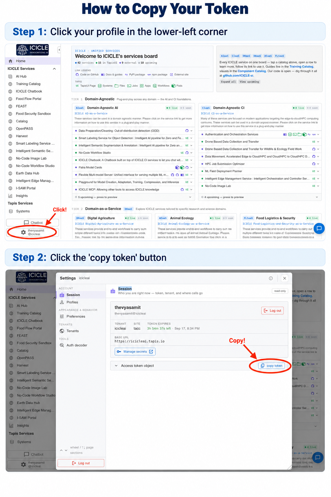

# ICICLE AI Chatbook

An interactive [marimo](https://marimo.io/) notebook that turns the ICICLE AI Tapis services into a hands-on RAG (retrieval-augmented generation) playground. Paste or upload a document (**PDF**, **DOCX**, **TXT**, **MD**, up to 2 MB) and chat against it — or come back later and chat against a collection you saved before. Every step is visible, from embeddings and chunking to retrieval, reranking, grounded prompting and LLM-as-judge evaluation, so newcomers to RAG can see how each piece works.

**Tags:** AI4CI, Software

For guidance on what to include in Tutorials, How-To Guides, Explanation, and Reference, see [Diátaxis](https://diataxis.fr/).

### License

[](https://www.gnu.org/licenses/gpl-3.0)

## References

- [ICICLE AI Tapis portal](https://icicleai.tapis.io) — where you log in and grab an access token.
- [Embedding service (`icicleaiembedserver`)](https://github.com/ICICLE-ai/icicle-ai-embed-service) — Qwen3-Embedding behind a JWT-gated FastAPI.
- [Vector service (`icicleaivecserver`) API docs](https://github.com/ICICLE-ai/icicle-ai-vector-service) — Qdrant-backed store with private per-user collections, cosine retrieval, and reranking (MMR, cosine rescore, cross-encoder).
- [marimo documentation](https://docs.marimo.io/) — the reactive Python notebook used to host this playground.
- [uv documentation](https://docs.astral.sh/uv/) — the package/env manager used to bootstrap the project.

## Acknowledgements

<!-- Please include other funding sources above this line. -->

*National Science Foundation (NSF) funded AI institute for Intelligent Cyberinfrastructure with Computational Learning in the Environment (ICICLE) (OAC 2112606)*

## Issue reporting

File bugs, ideas, or questions on the [GitHub issues page](https://github.com/thevyasamit/icicle-chatbook/issues).

---

# Tutorials

## Run the RAG playground end-to-end

This tutorial walks a first-time user from a clean checkout to chatting with their own document.

### Prerequisites

- macOS or Linux shell (the commands below are zsh/bash).
- [`uv`](https://docs.astral.sh/uv/) installed (`brew install uv` on macOS).
- A free account on the [ICICLE AI Tapis portal](https://icicleai.tapis.io) — TACC login, CILogon (university SSO), or self-signup all work.

### Steps

1. **Clone and enter the repo.**
   ```bash
   git clone https://github.com/thevyasamit/icicle-chatbook.git
   cd icicle-chatbook
   ```
2. **Sync the environment.** `uv` reads `pyproject.toml` + `uv.lock` and creates `.venv/` with `marimo` and `requests` pinned.
   ```bash
   uv sync
   ```
3. **Launch the notebook in app mode** (code hidden, chat-style UI):
   ```bash
   uv run marimo run notebooks/rag_chat_marimo.py
   ```
   Or in editor mode (code visible, hot-reload) while developing:
   ```bash
   uv run marimo edit notebooks/rag_chat_marimo.py
   ```
4. **Grab a Tapis access token** from [icicleai.tapis.io](https://icicleai.tapis.io) (click your username in the bottom-left → *Copy Access Token*; screenshot in [Get a Tapis access token](#get-a-tapis-access-token)), paste it into the token box, and click **🔐 Validate token**. Deployed as a Tapis pod, this step disappears — see [Sign-in: pasted token or Tapis session](#sign-in-pasted-token-or-tapis-session).
5. **Give the chat something to search** — either:
   - **Ingest a document:** paste text or upload a file, check the collection name next to the button, and click **🚀 Ingest into vector store**. The chat switches to that collection automatically; or
   - **Reuse a saved one:** in **🗂️ Your collections**, select a row and click **💬 Use in chat**. No re-ingesting needed.
6. **Ask questions** in the panel at the bottom. Each message embeds the question, retrieves and reranks the nearest chunks, stitches them into a grounded prompt, and sends it to the chat model. Ask directly for back-and-forth, or turn on the **📚 Study mode** switch to keep notes beside the conversation while you read.

### End result

A working in-browser RAG demo backed by your own document. The notebook surfaces the retrieved chunks (with their scores) under each answer so you can see exactly what the model was given.

> 💾 **Chats aren't saved in this release.** Closing the tab or letting the session expire loses the conversation — use **⬇️ Export session (.md)** to keep a copy. Your ingested collections *are* kept.

---

# How-To Guides

## Get a Tapis access token

1. Visit [icicleai.tapis.io](https://icicleai.tapis.io) and sign in (TACC account, fresh signup, or CILogon).
2. Click your **username** in the bottom-left corner.
3. Choose **Copy Access Token** and paste the JWT into the notebook.



> ⏰ Tokens expire after ~4 hours. If you start seeing `401 Token expired`, refresh the token from the Tapis UI and paste it again.

## Tune ingestion behaviour

Open the *⚙️ Ingestion settings* accordion in the notebook:

- **Topic** — a label stored with every chunk you ingest (e.g. `paper-2024`). One collection can hold several topics; the chat can later search one of them or all. The collection itself is named next to the **Ingest** button.
- **Chat model** — the list is fetched live from LiteLLM's `/v1/models` when you validate your token, so it always matches what TACC actually hosts (audio models like `whisper-large-v3` are filtered out).
- **Top-K retrieval** — how many chunks to pull back per question. Raise it for broader context; lower it to keep prompts tight.
- **Rerank** — how the retrieved chunks are reordered; see [Choose a rerank method](#choose-a-rerank-method).
- **Max chunk tokens / Chunk overlap tokens** — chunking budget. Larger chunks preserve more context per vector; overlap reduces "split at a bad spot" misses.

## Manage collections and choose what to chat with

**🗂️ Your collections** (below the ingest box) lists every collection you own — three per page, with
page numbers to click — showing its embedding count, topics and vector dimension. The table's own
toolbar lets you search and filter it.

- **💬 Use in chat** — select **one** row to point the chat at it. A *Chatting with …* line appears
  above the chat with a **Topic** picker: **All topics**, or one topic to narrow retrieval to a single
  document.
- **Ingesting** also points the chat at the collection you just filled, filtered to the topic you
  ingested under.
- **🗑️ Delete selected** — select **one or more** rows. Permanently removes your embeddings in them.
- Until a collection is picked or ingested, the chat asks you to do one or the other.

Collections are **private to your token**: the vector service keeps each user's collections
separately, so two people can both have `icicle-demo-collection` without seeing each other's data.
Names are normalised by the service — `icicle-demo-collection` is listed as `icicle_demo_collection`
and both refer to the same collection.

## Choose a rerank method

Plain vector search returns the top-K chunks by cosine similarity. Reranking asks the vector service
for a wider shortlist (`max(20, 5 × top-K)` candidates) and reorders it before the top K reach the
model. Pick one in *⚙️ Ingestion settings → Rerank*:

| Method | What it does | Pick it when | Cost |
| --- | --- | --- | --- |
| **MMR** *(default)* | Balances relevance against diversity, so near-duplicate chunks don't crowd the context | General use; documents that repeat themselves or overlapping chunks | Fast |
| **Cross-encoder** | A model reads the question and each chunk *together* and scores true relevance | Precise questions where the best chunk must win; the most accurate option | Slowest; the first call loads the model |
| **Cosine rescore** | Recomputes exact cosine over the shortlist and re-sorts | You want plain similarity ranking, minus the small errors of approximate search | Fast |
| **Off** | Top-K straight from vector search | Baseline comparisons, or the fastest answers | Fastest |

With reranking on, each chunk under an answer shows both its **rerank score** (what the order is based
on) and its original cosine **score**, and the footer names the method used. The method is also logged
to MLflow, so you can compare methods on the **Found the right passages** score. If the cross-encoder
isn't installed on the service, the answer says so — pick another method.

## Take notes while you read (Study mode)

A question occurs to you halfway through a long answer, and asking it scrolls away what you were
reading. **📚 Study mode** (the switch beside **💬 Chat**) puts a notes panel next to the conversation.

1. Type a thought, click **➕ Add**, and tag it **❓ Ask later** or **📝 Just a note**. Notes are never
   sent anywhere; **✖** drops an item.
2. Click **📤 Ask N questions**. With two or more queued you can tick **Answer them together in one
   reply** — one prompt, one retrieval, faster but less precise.
3. A confirmation panel lists what will go out before anything is sent.
4. **⬇️ Export session (.md)** downloads every question, answer and kept note. Chats aren't saved in
   this release — closing the tab or letting the session expire loses them — so export anything you
   want to keep.

Both ways of asking feed one conversation, newest answer expanded at the top. The switch only shows
or hides the panel, so nothing is lost.

By default the conversation **remembers itself**: the last few turns are folded into the prompt, so
a follow-up like *"explain the second one"* resolves against what was just said. Retrieval still
embeds your question on its own, so chunk selection stays predictable. Turn the behaviour off with
the **Remember conversation** switch.

## Score answers with an LLM judge (G-Eval) and log to MLflow

Every answer can be graded in the background by a second model, with the scores logged to MLflow so
you can see whether a settings change actually helped.

### What gets scored

Four dimensions, each 1–5, each judged by its own prompt:

| Dimension | Question it answers |
| --- | --- |
| **Faithfulness** | Is every claim in the answer supported by the retrieved chunks? (the hallucination check) |
| **Answer relevance** | Does the answer address what was actually asked? |
| **Context relevance** | Were the retrieved chunks any good? — this scores the **retriever**, so it's the number to watch when tuning Top-K and chunk size |
| **Coherence** | Is the answer well organised and readable? |

Alongside those, each turn logs metrics that cost nothing extra: mean/max/min retrieval score,
per-stage latency (embed, retrieve, chat, judge), chunk count, and answer length.

The judge defaults to a **different model family than the one that answered** — a model asked to
grade its own output scores it generously. Override with `ICICLE_JUDGE_MODEL`.

### Turning it on

Evaluation runs by default and shows scores inline. MLflow logging is separate: the **hosted
chatbook already logs to the ICICLE MLflow pod**, so there's nothing to set up. Running locally, it
stays off until you point it at an MLflow of your own:

```bash
export MLFLOW_ENABLED=true
export MLFLOW_TRACKING_URI="https://<your-mlflow>"
uv run marimo run notebooks/rag_chat_marimo.py
```

| Variable | Default | Purpose |
| --- | --- | --- |
| `MLFLOW_ENABLED` | `false` | Master switch for metric logging |
| `MLFLOW_TRACKING_URI` | *(empty)* | MLflow server. Empty → logging disabled |
| `MLFLOW_EXPERIMENT` | `icicle-chatbook` | Experiment to log into |
| `MLFLOW_TIMEOUT_SECONDS` | `2.0` | Per-call timeout |
| `MLFLOW_LOG_CONTENT` | `1` | Log questions/answers/rationales; `0` = metrics only |
| `MLFLOW_TRACING_ENABLED` | follows `MLFLOW_ENABLED` | GenAI trace emission (the Traces tab) |
| `ICICLE_JUDGE_MODEL` | `gpt-oss-120b` | Default judge model |
| `ICICLE_EVAL_ENABLED` | `1` | Judge kill switch |
| `ICICLE_TOKEN_SOURCE` | `auto` | Where the Tapis token comes from — `auto`, `cookie`, `manual` |

These are read at startup, so set them before launching. On a pod they go in the pod's environment
config; nothing MLflow-related is baked into the image. In the app you can still switch judge model
or turn judging off for the session.

One MLflow run per session, one step per turn, so each dimension plots as a curve. Give it its own
experiment name — `icicle-ai-embed-service` logs one run per *request*, and mixing both shapes in one
experiment makes the run table unreadable.

> ⚠️ **Cost:** 4 extra model calls per answer. **Privacy:** questions, answers, chunks and judge
> reasoning are logged; `MLFLOW_LOG_CONTENT=0` keeps metrics only.

### Trace each turn into MLflow's GenAI tab

Metrics fill MLflow's *experiment* table; the **Traces** tab shows one RAG turn as a tree. Set
`MLFLOW_TRACING_ENABLED=true` (it follows `MLFLOW_ENABLED`). Needs MLflow 3.x with a SQL-backed
store — a file store can't ingest traces.

| Span | Type | Carries |
| --- | --- | --- |
| `rag_turn` | `CHAIN` | question, answer, topic/top-K/rerank method, per-stage latency |
| `embed_query` | `EMBEDDING` | vector dimension |
| `retrieve` | `RETRIEVER` | retrieved (and reranked) chunks as `Document`s, with scores and provenance |
| `generate` | `LLM` | model id, chunk count, answer |

The `RETRIEVER` type matters: MLflow's built-in RAG judges only see retrieval when a span is typed
that way with `Document` outputs. `MLFLOW_LOG_CONTENT=0` applies here too — spans keep their shape
and drop the text.

### Which models are actually up

`GET /v1/models` lists what the proxy is configured with, not what answers. So once your token
validates, the notebook pings every model in the background and marks both dropdowns: **✅** answered,
**❌** didn't (sorted last). One line underneath gives the tally and a **🔄 Re-check** button. A model
that fails its ping is never left selected.

### Reading the results

Scores appear under each answer as a plain-language **🧪 Answer check**, out of 5 and colour-coded
(🟢 4–5 · 🟡 3–3.9 · 🔴 below 3). They land a few seconds after the answer — the judge runs in a
background thread.

| Shown as | G-Eval dimension | What it checks |
|---|---|---|
| Sticks to the document | Faithfulness | Every claim is backed by the retrieved passages |
| Answers the question | Answer relevance | It addresses what was asked |
| Found the right passages | Context relevance | Retrieval quality, judged without seeing the answer |
| Clearly written | Coherence | Structure and readability |

**What do these scores mean?** expands each check with the judge's own reasoning.

## Sign-in: pasted token or Tapis session

On a Tapis pod the browser already holds an `X-Tapis-Token` cookie, and marimo passes the request to
the kernel — so the notebook reads the token from there, validates on load, and hides the paste box
and the token walkthrough entirely. Locally there's no cookie, so you paste one as usual.

| `ICICLE_TOKEN_SOURCE` | Behaviour |
| --- | --- |
| `auto` *(default)* | Cookie if there is one, otherwise paste — right in both places |
| `cookie` | Same, but says so when the cookie is missing |
| `manual` | Ignore the cookie; test the paste flow on a pod |

Sessions expire after ~4 hours; the notebook then asks for a page reload, which signs you in again.

### Preload a token via environment variable

Locally, skip the paste step by exporting `TAPIS_TOKEN` before launching marimo — the token input
prefills from `os.environ["TAPIS_TOKEN"]`.

```bash
export TAPIS_TOKEN="eyJ..."
uv run marimo run notebooks/rag_chat_marimo.py
```

## Reset the local environment

If dependencies get out of sync or you want a clean rebuild:

```bash
rm -rf .venv uv.lock
uv sync
```

---

# Explanation

## What the playground does

The notebook is a thin client over three ICICLE Tapis services, glued together behind one access token. Each chat turn runs the full RAG loop:

| Step | Service | Endpoint | What happens |
| --- | --- | --- | --- |
| **1. Embed** | `icicleaiembedserver` | `POST /v1/embed` | Text → 1024-dim normalized vector (Qwen3-Embedding via `llama-cpp-python`). |
| **2. Store / retrieve** | `icicleaivecserver` | `POST /v1/embeddings`, `POST /v1/retrieve`, `POST /v1/rerank`, `GET`/`DELETE /v1/collections` | FastAPI + Qdrant; private per-user collections, cosine search, and MMR / cosine-rescore / cross-encoder reranking. |
| **3. Chat** | `litellm` | `POST /v1/chat/completions` | OpenAI-compatible proxy on the `tacc` tenant. Generates the answer, and runs the G-Eval judge. |

Every request carries the same `X-Tapis-Token` (sent as both header and cookie), so authenticating once unlocks the whole pipeline — **including MLflow**, which is a Tapis-gated pod rather than a separate credential.

Note the two tenants: embed and vector are on `icicleai`, LiteLLM is on `tacc`. The notebook checks both when you validate and reports them separately, because a token can be good for one and not the other. A token that works for embed but not LiteLLM can still ingest.

## Why marimo?

marimo gives a reactive, code-first notebook with first-class UI widgets (`mo.ui.text`, `mo.ui.chat`, `mo.ui.run_button`) and an "app mode" that hides cells — useful for handing the notebook to non-developers without exposing the implementation. Reactivity also means the validation, ingestion, and chat cells re-evaluate cleanly whenever the token or ingest state changes.

## Design choices worth knowing

- **Validate before ingest.** The token cell hits `/v1/model` once and only unlocks downstream cells on a 200. This catches expired or wrong-tenant tokens before any embedding API spend.
- **Token-budget chunking.** A naive word-split with configurable max/overlap. Good enough for demo content; swap in `tiktoken` or a recursive splitter for production-grade ingestion.
- **Source metadata is stored alongside vectors.** `doc_id`, `chunk_index`, `chunk_count`, and a free-form `source` label travel with each vector so retrieval results stay traceable.
- **Reranking is a shortlist, not a second search.** The service retrieves `max(20, 5 × top-K)` candidates once and reorders them. That is enough headroom for reranking to change the answer, and small enough that the cross-encoder — one model pass per candidate — stays quick on CPU.
- **The chat is scoped to a collection you pick, not to this session's ingest.** Collections persist on the vector service, so a returning user picks one and starts asking. Each answer records the collection and topic it actually searched.
- **Chats live only in the browser session.** Nothing server-side stores the conversation in this release, which is why the export button sits right under the chat.
- **Retrieved chunks are echoed under every answer** in a collapsible `<details>` block — the demo prioritizes legibility/auditability over a polished chat surface.
- **The pad batches questions behind a confirmation gate.** It is deliberately not a chat box: questions accumulate while you read, and the send is a two-step action so a stray click can't spend API calls.
- **The chat surface is hand-rolled rather than `mo.ui.chat`.** That widget owns its history on the frontend with no Python-side injection, so batched questions could never join its conversation. Keeping history in `mo.state` gives one shared conversation, makes the Study mode switch a free re-render, and allows multi-turn memory.
- **Answer evaluation is experimental and follows the G-Eval baseline.** The judge uses the structure from the G-Eval paper: a task introduction, the scoring criteria, evaluation steps the judge writes itself, then a score. The evaluation steps depend only on the criteria, so they are generated once per session and reused, as in the paper. G-Eval also weights each score by the probability of the score token. The notebook does this when the model returns token probabilities (`logprobs`), giving scores such as `4.28`, and otherwise uses the whole-number score the judge wrote. The `geval_mode` tag records which method was used. The evaluation can be customized: the judge model is set with `ICICLE_JUDGE_MODEL` or in the app, and the criteria for each dimension are defined in `GEVAL_DIMENSIONS` in the notebook.
- **Each dimension is judged only on the inputs it needs.** Context relevance is scored without the answer, so it measures retrieval alone and a well-written answer cannot hide poorly retrieved passages.
- **MLflow is used to monitor answer quality and retrieval over time.** Metrics are sent through MLflow's REST API, the same approach as `icicle-ai-embed-service`, so the full `mlflow` package is not needed. Traces use the smaller `mlflow-tracing` package (about 5 MB, compared with about 1 GB for full MLflow). Each request is authenticated with the user's own Tapis token, so no separate service account is required.
- **Evaluation never blocks an answer.** If the judge fails, returns an unreadable score, MLflow is unreachable or the token has expired, the error is recorded with that turn and the answer is still shown. Scoring runs in the background, so it does not slow down answers.
- **Conversation memory is capped and clearly demoted.** Only the last three turns go into the prompt, each answer truncated, and the block is labelled as being for resolving references only — the retrieved chunks stay the sole source of facts.

## Project layout

```
icicle-chatbook/
├── assets/                  # Images referenced by the notebook (logo, screenshot)
├── notebooks/
│   └── rag_chat_marimo.py   # The marimo notebook
├── pyproject.toml           # uv-managed project metadata + deps
├── uv.lock                  # Pinned dependency lockfile
└── README.md
```
